<!-- markdownlint-disable MD025 MD034 MD045 -->

## Lesson 1 - Git Basics

Introduction to Git, and some basic git commands.

<br />

<!--  -->


::: notes
Git Logo by Jason Long is licensed under the Creative Commons Attribution 3.0 Unported License.
:::

---

### What You’ll Learn Today
<!-- [TODO: change slide title] -->

* What is Git and why use it
* How repositories work
* Create a repository with `git init`
* Copy a repository with `git clone`
* How to commit changes
* How to push changes to a remote

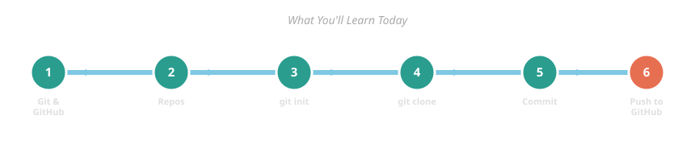

---

## What is Git and Why Use It

---

### Why Version Control Matters

* Track changes over time
* Recover from mistakes
* Compare versions
* Collaborate safely
* Build a project history

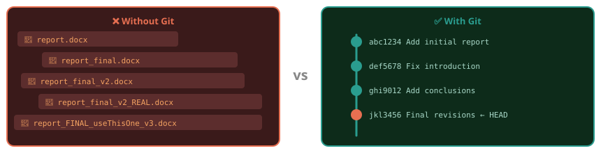

::: notes
Version control is a fundamental tool for software development and increasingly for data science and other fields. It allows you to manage changes to your project over time, collaborate with others, and maintain a history of your work.
:::

---

### History of Version Control

* Version control has been around since the 1970s
* Early systems were centralized (e.g. CVS, Subversion)
* Git introduced in 2005 as a distributed system
* Distributed VCS allows for local commits and offline work

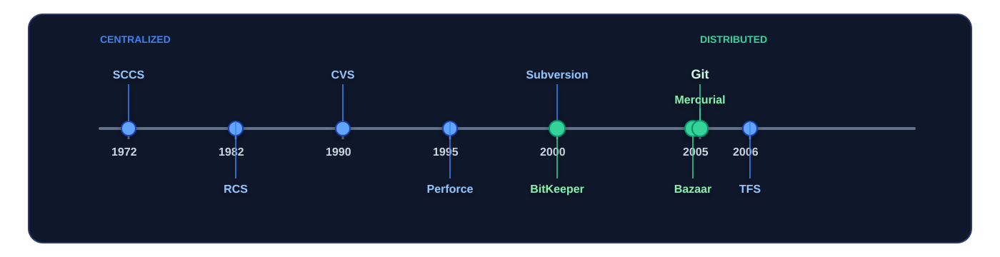
<!-- 
**image**: diagram showing timeline of version control systems,
- 1972 SCCS
- 1982 RCS
- 1990 CVS
- 1995 Perforce
- 2000 Subversion
- 2005 Git, Mercurial, Bazaar
- 2006 TFS
with central,distributed groups
-->

::: notes
Version control is sometimes called source control, source code management (SCM), or just versioning. The terms are often used interchangeably, but VCS and SCM can have slightly different connotations.
VCS - Version Control System.
SCM - Source Code Management.

Version control has evolved over decades, with Git (and other VCS releases around the same time) representing a major shift to distributed version control. This allows for more flexible workflows and better support for collaboration.

:::

---

### Why Git?

* Fast and efficient
* Flexible branching and merging
* Large ecosystem and community
* Widely adopted in industry
* GitHub makes it easy to share and collaborate

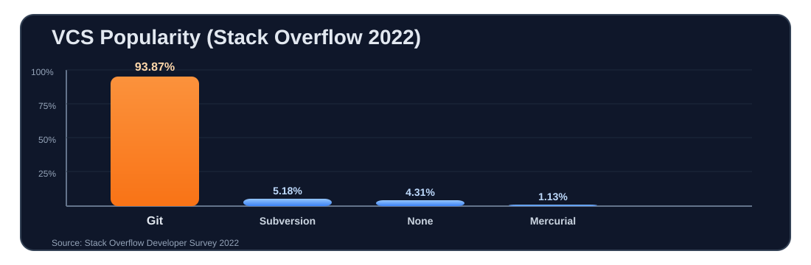

::: notes
Data source: Stack Overflow Developer Survey 2022, showing version control usage among developers. [https://survey.stackoverflow.co/2022/#version-control-version-control-system]
:::

---

### What Is Git?

* Git is a distributed version control system
* Created by Linus Torvalds for Linux development
* Free and open source software
* Fast, flexible, and widely adopted

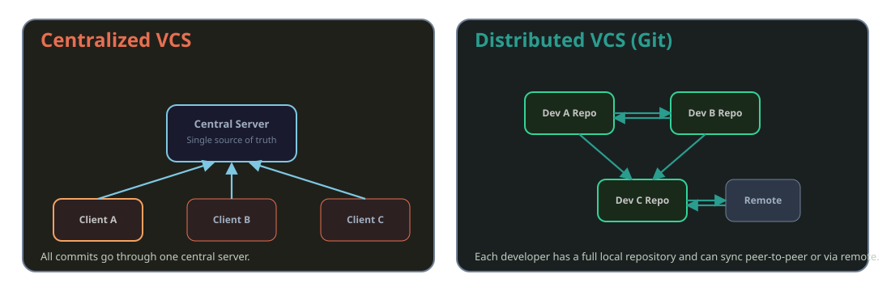

::: notes
Originally, Linux used BitKeeper, a proprietary VCS, but in 2005 the relationship between the Linux community and BitKeeper's owner broke down. Linus Torvalds created Git as a new distributed VCS to meet the needs of Linux development. The design of Git was influenced by the strengths and weaknesses of existing VCS (a particular dislike of CVS's handling of branching and merging).
Git's distributed nature allows for more flexible workflows, better support for branching and merging, and improved performance.

Interestingly, during the same weekend as Git's initial creation, another Linux kernel developer tried to solve the same problem by creating Mercurial, another distributed VCS.
:::

---

### Git vs. GitHub

* Git = tool installed on your computer
* GitHub = website for hosting and sharing Git repos
* Git works offline
* GitHub helps teams collaborate

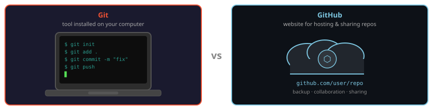

---

## Using Git

---

### What Is a Repository?

* A project folder tracked by Git
* Contains files plus hidden Git history
* Git stores snapshots of changes
* Repositories can be local or remote


---

### Local vs. Remote Repositories

* Local repo: on your computer
* Remote repo: hosted elsewhere, usually GitHub
* You work locally, then sync changes
* Remote repos help with backup and collaboration

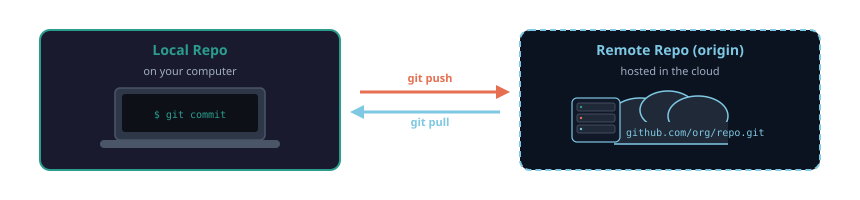

::: notes
[TODO]
Strictly speaking, a remote repository doesn't have to be on a separate server, it just has to be a separate repository that you push and pull to. You could have two repositories on the same machine and push and pull between them. But in practice, remote repositories are usually hosted on platforms like GitHub, GitLab, or Bitbucket.
:::

---

### Two Ways to Start

1. Create a new repo with `git init`
2. Copy an existing remote repo with `git clone`

**Key idea:** Both paths lead to a local Git repository.

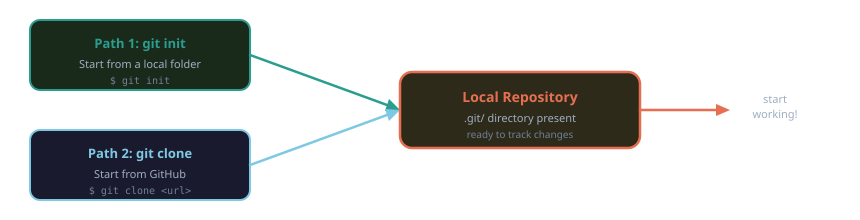

::: notes

:::

---

### Path 1 - Starting with `git init`

```bash
mkdir my-project
cd my-project
git init
```

* Creates a new Git repo in an existing folder
* Adds a hidden `.git` directory
* Best when starting a brand-new local project

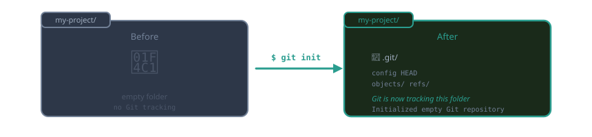

---

### Path 2 - Starting with `git clone`

```bash
git clone <repo-url>
cd <repo-name>
```

* Copies an existing remote repo to your computer
* Includes files and Git history
* Automatically connects to the remote as `origin`

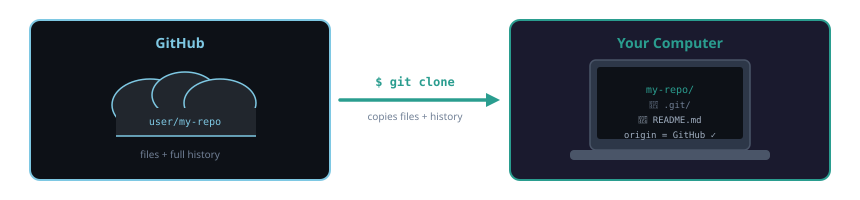

---

### The Basic Git Workflow

1. Edit files
2. Check status
3. Stage changes
4. Commit changes
5. Push to GitHub

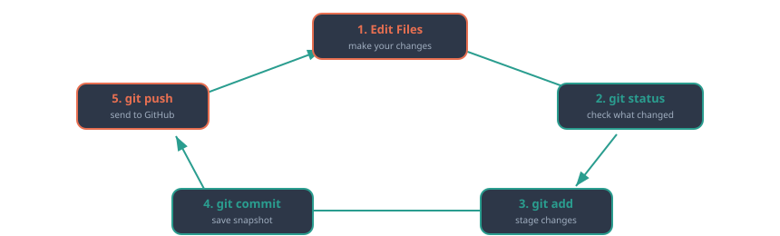

::: notes
[TODO notes about git being deliberate, not automatic: and why this is good]
:::

---

### The 3 Areas of Git

* Working directory: files you are editing
* Staging area: changes selected for commit
* Repository: saved project history

```bash
git status
git add
git commit
```

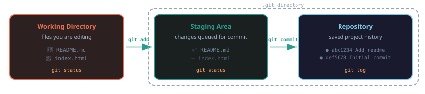

::: notes
[TODO]
:::

---

### Checking Your Repo with `git status`

```bash
git status
```

* Shows changed files
* Shows staged and unstaged changes
* Helps you know what Git sees

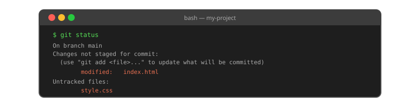

---

### Slide 13: Staging Changes with `git add`

```bash
git add filename
git add .
```

* `git add filename` stages one file
* `git add .` stages all current changes
* Staging lets you choose what goes into the next commit


---

### Slide 14: Saving Changes with `git commit`

```bash
git commit -m "Add homepage"
```

* A commit is a saved snapshot
* Commit messages should explain the change
* Good commits are small and focused


---

### Slide 15: Viewing History with `git log`

```bash
git log
git log --oneline
```

* Shows previous commits
* Includes commit ID, author, date, and message
* Useful for understanding project history


---

### Slide 16: Comparing Changes with `git diff`

```bash
git diff
```

* Shows what changed before committing
* Helps review your work
* Reduces accidental commits


---

### Slide 17: Intro to Remotes

* A remote is a linked copy of your repo hosted elsewhere
* GitHub repos are commonly used as remotes
* `origin` is the default remote name
* Remotes let you push and pull work

**Command:**

```bash
git remote -v
```


---

### Slide 18: Pushing Changes to GitHub

```bash
git push
```

* Sends local commits to the remote repo
* Updates GitHub with your latest work
* Requires permission to push


---

### Slide 19: Pulling Changes from GitHub

```bash
git pull
```

* Brings remote changes down to your computer
* Keeps your local repo up to date
* Mention only briefly; deeper syncing comes later


---

### Slide 20: Demo - Local-First Workflow

Demo steps:

1. Create folder
2. Run `git init`
3. Add a file
4. Stage and commit
5. View history


---

### Slide 21: Demo - GitHub-First Workflow

Demo steps:

1. Open GitHub repo
2. Copy clone URL
3. Run `git clone`
4. Edit a file
5. Commit
6. Push


---

### Slide 22: Hands-On Activity

Students complete:

* `git init` workflow
* `git clone` workflow
* One commit in each repo
* One push to GitHub


---

### Slide 23: Common Mistakes

* Forgetting to `cd` into the repo
* Forgetting to stage before commit
* Trying to push without committing
* Cloning into the wrong folder
* Confusing Git with GitHub


---

### Slide 24: Key Commands Recap

```bash
git init
git clone
git status
git add
git commit
git log
git diff
git remote -v
git push
git pull
```


---

### Slide 25: Wrap-Up

By now, students can:

* Explain Git vs. GitHub
* Create a repo with `git init`
* Clone a repo with `git clone`
* Commit changes
* Push to GitHub


