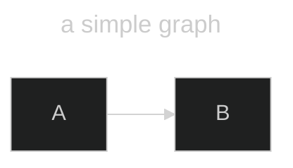
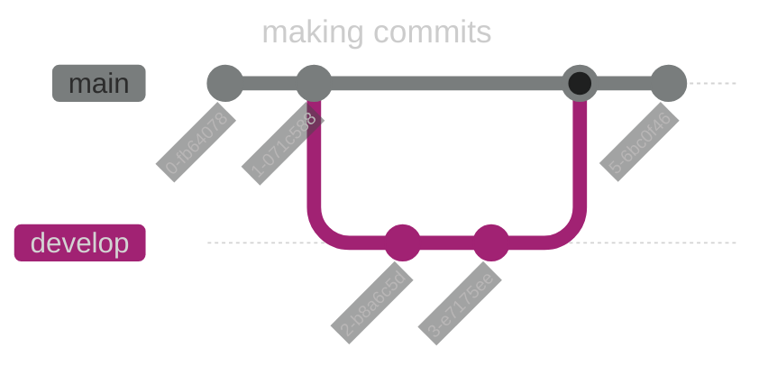

<!-- markdownlint-disable MD025 MD034 MD045 -->

## Slide 1

This is the first slide.

---

## Slide 2

This is the second slide.

- This is a bullet point
- <span style="color:#cc0000">This is another bullet point</span>

---

# {background-color="#ff0000"}
## Background Color

This slide has a red background.

---

# {data-transition="zoom"}
## Transition

- Additional slide attributes can be specified.
  - Deck attributes can be specified in the YAML front matter.
  - Per slide attributes can be specified on `#` lines.
- This slide has a zoom transition.
- See the [Reveal.js documentation](https://revealjs.com/) for more information.

---

## Columns

:::::::::::::: {.columns}
::: {.column width="50%"}
Slides can contain columns.
:::
::: {.column width="50%"}
Column width can be specified.
:::
::::::::::::::

---

## Speaker Notes

Slides can contain speaker notes.

(<code>`s`</code> to open speaker notes)

::: notes

Speaker notes go here.

:::

---

## Code

Code can be included in slides:

```python
message = "Hello, world!"
print(message)
```

---

## Math

Math formulas can be included in slides:

$$
\begin{aligned}
\frac{d}{dx} \left( \int_{0}^{x} f(u) \, du\right) &= f(x)
\end{aligned}
$$

---

## Diagrams

Diagrams can be included in slides:



This one can too:



---

## Images

Images can be included in slides:


---

# {data-background-image="https://picsum.photos/1920/1080"}
## Background Image

This slide has a background image.

---

# {data-line-numbers="1|2|3"}
## More Code

This is a slide with some code:

```python
name = input("What is your name? ")
message = f"Hello {name}"
print(message)
```

---

## More Images

:::::::::::::: {.columns}
::: {.column width="50%"}
This is a slide with an image:
:::
::: {.column width="50%"}

:::
::::::::::::::

---
